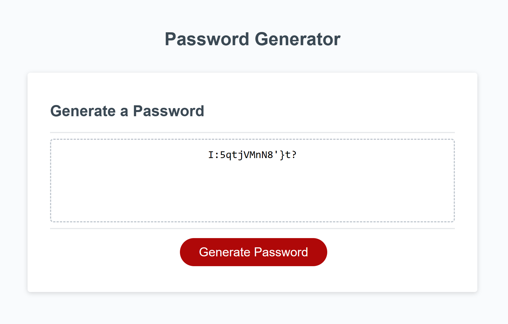

# Password Generator

# Purpose

It will randomly generate a password. It contains an HTML file for the structure of the page, JavaScript to program the features of the page, and CSS for style. At first it will ask a series of prompts of what the password should contain. Password can have at least one of these prompts: lowercase, numbers, uppercase or symbols. If not one of these are chosen, then it will ask that you select at least one. It will also ask the user how many characters the password should be made of. It can only be between 8 to 128 chracters.

# Usage

1. Open the password generator.
2. The user will then click on the "Generate Password", from there it the user to pick from 8 to 128 special characters.
3. A series of prompts asking if user would want a password with numbers, uppercase, lowercase letters or specials chracters. One of these prompts need to be choosen, if hit cancel on all prompts, it will then alert the user to choose at least one.
4. If one prompt or more is selected, then it will generate a password with the number of characters the user has picked.

# Files included

* Javascript
* Css
* Html
* README
* Images

# Images

# Credits

Created by Yadira Cervantes with support and help from TA Jen Doyle, TA Chris Yang and tutor Jose Lopez.