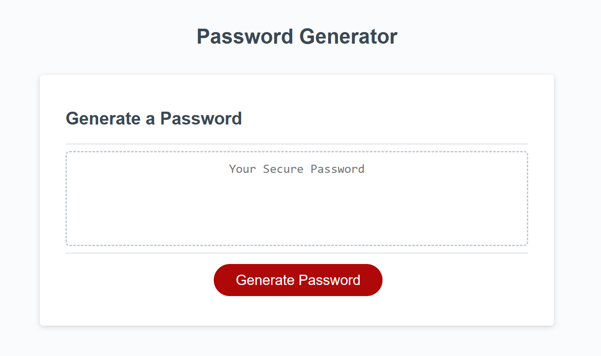
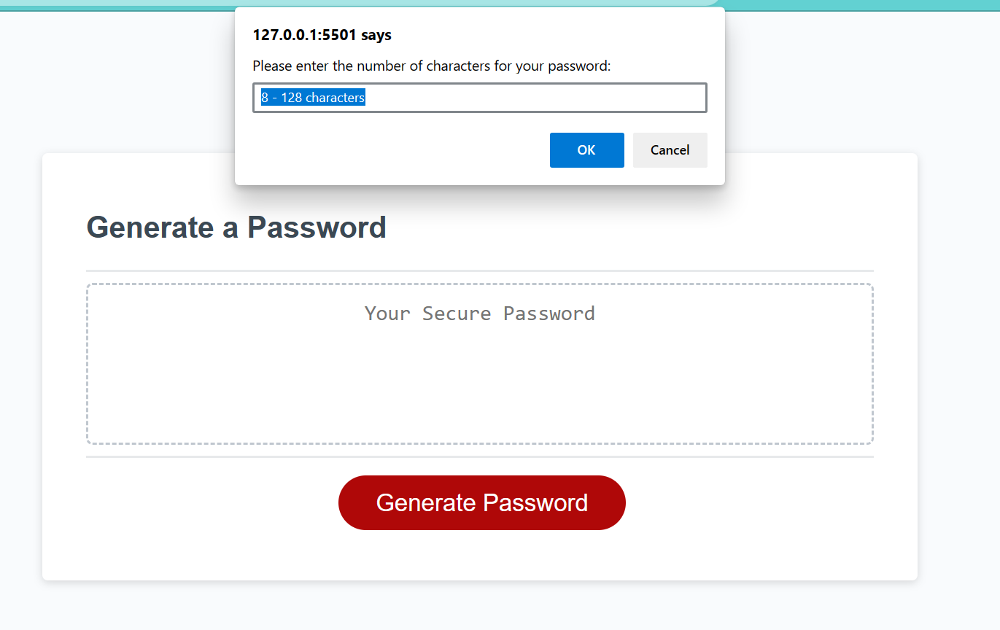
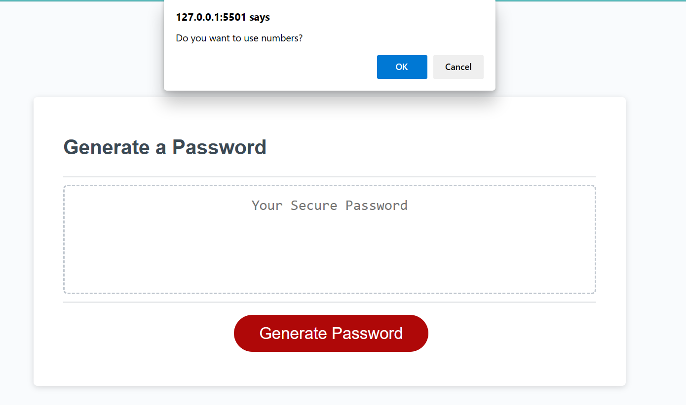
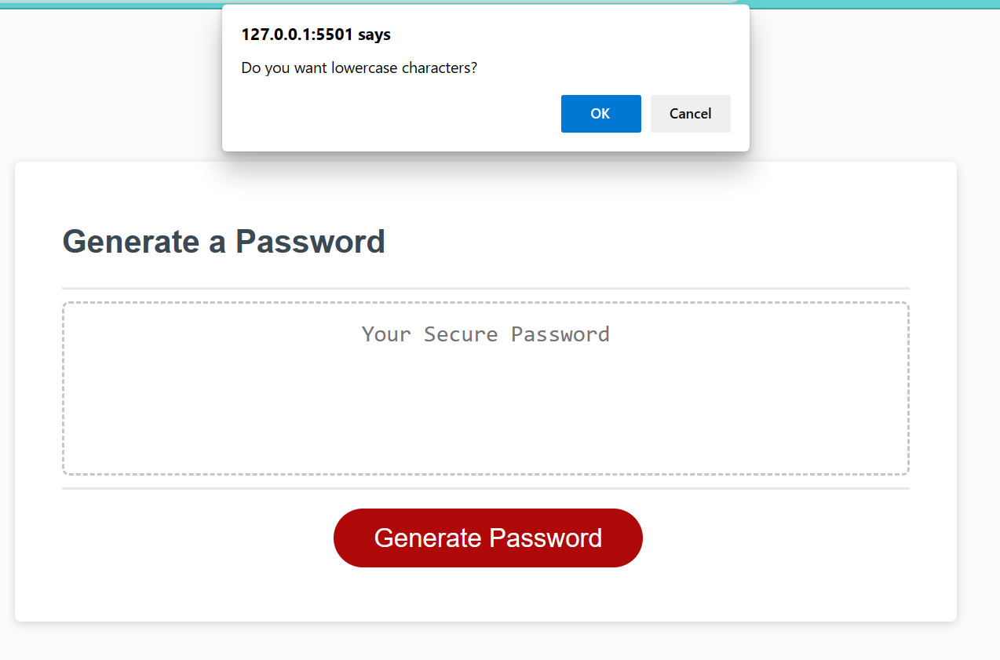
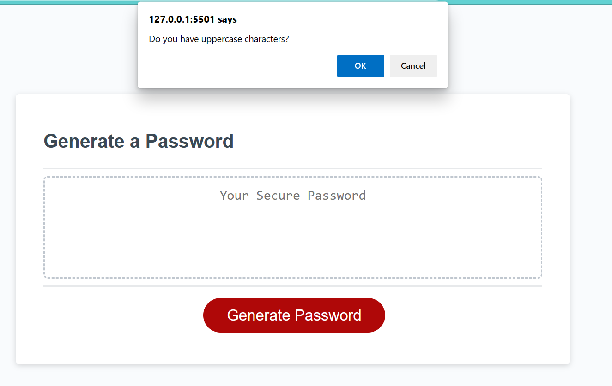
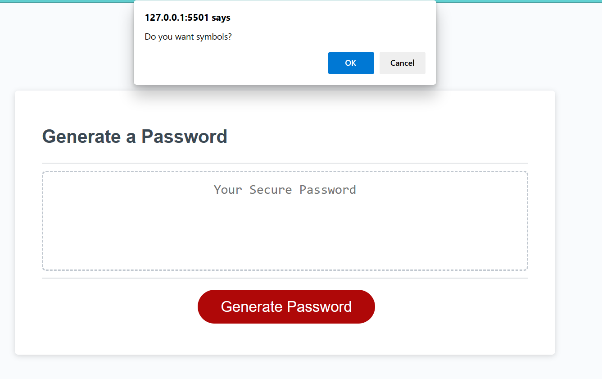

# Password Gneerator

# Purpose

It will randomly generate a password. It contains an HTML file for the structure of the page, JavaScript to program the features of the page, and CSS for style. At first it will ask a series of prompts of what the password should contain. Password can have at least one of these prompts: lowercase, numbers, uppercase or symbols. If not one of these are chosen, then it will ask that you select at least one. It will also ask the user how many characters the password should be made of. It can only be between 8 to 128 chracters.

# Usage

Open the password generator.
The user will then click on the "Generate Password", from there it will generate a password with 8 random characters. 

# Files included

* Javascript
* Css
* Html
* README

# Images

